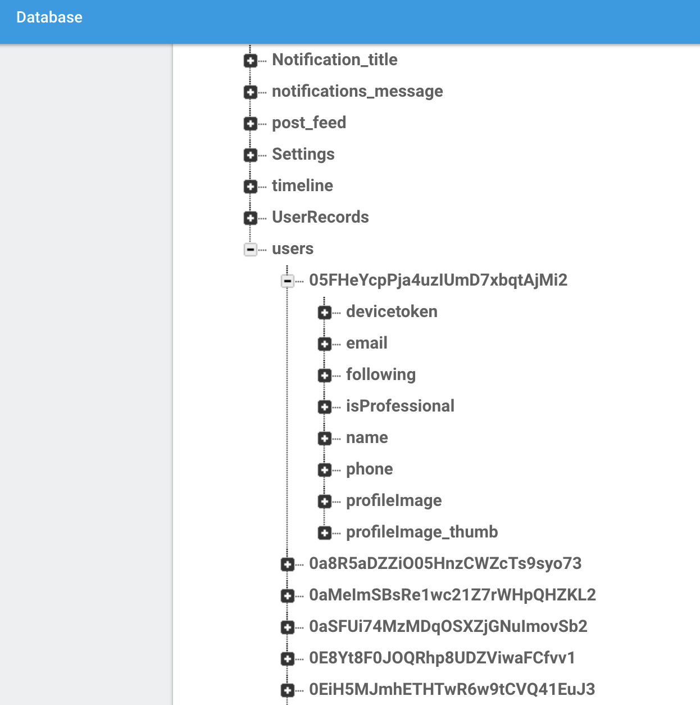

```
function ImportJSON(url) {
  var jsondata = UrlFetchApp.fetch(url);
  var object   = JSON.parse(jsondata.getContentText());
  
  return Object.keys(object).map(function(uuid) {
    return object[uuid].email;
  }).filter(function(email){
    return email != undefined && email != null && email != '';
  });
}
```
Call the function by typing `ImportJSON(YOUR_URL_HERE)` in a cell on Google Sheets. 

Below is the shape of the JSON parsed.

